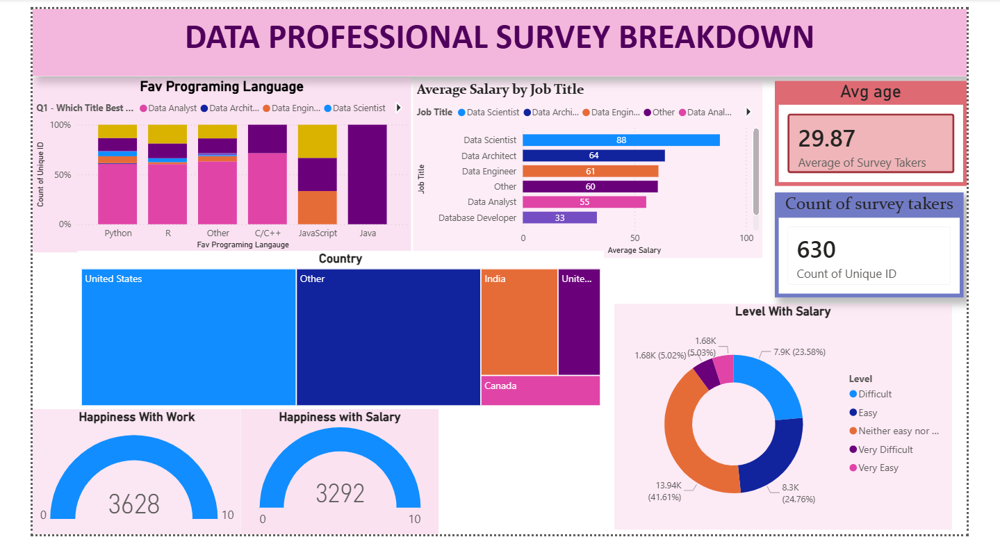

# Data Professional Salary Survey Dashboard (Power BI)

## Project Overview
This project involves building an interactive dashboard using **Power BI** to analyze survey responses from data professionals worldwide. The analysis focuses on understanding industry salary benchmarks, job roles, geographic distribution, and workplace satisfaction metrics across fields like Data Analysis, Data Science, and Data Engineering.

The end-to-end process included data ingestion, transforming messy survey responses via Power Query, data modeling, and creating user-friendly visuals.

## Key Insights & Dashboard Features
* **Demographics & Geography:** Visualizes where survey takers are located globally and how participation breaks down by region.
* **Salary Benchmarks:** Explores the average salary distribution relative to different job titles (e.g., Data Analyst vs. Data Engineer vs. Data Scientist).
* **Workplace Sentiment:** Tracks professional happiness levels concerning current salaries, work-life balance, and job roles.
* **Interactive Filtering:** Built with dynamic filters to allow stakeholders to filter the data by country, education level, or specific tech stacks.

---

## Final Dashboard Preview

---

## Technical Skills Demonstrated
* **Power Query:** Data cleaning, removing null values, renaming columns, and handling unformatted survey text.
* **Data Modeling:** Creating structured tables and relations to ensure clean filtering behavior.
* **Data Visualization:** Design of professional bar charts, cards, maps, and gauge charts with a cohesive color palette.
* **UX/UI Design:** Organizing slicers and key metrics logically for executive-level reporting.

## How to View the Project
1. Download the `visualization power BI.pbix` file from this repository.
2. Open it using **Power BI Desktop** to view the interactive elements, data transformations, and underlying data model.
